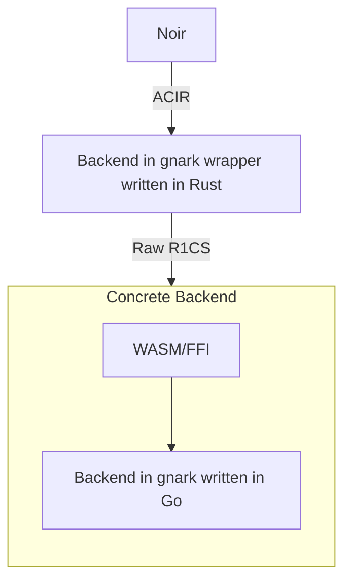

# Using gnark as a backend for Noir

If you want to develop a backend for Noir, basically what you need to do is to translate an ACIR (Abstract Circuit Intermediate Representation) to something that your backend could understand.
The prerequisites for this are to have certain knowledge about ACIR and its codebase, and the backend that you are going to support.
In this case, the backend is [gnark](https://github.com/ConsenSys/gnark). Written in Go, gnark is a fast zk-SNARK library that offers a high-level API to design circuits. This library is open-source and developed under the Apache 2.0 license.

## Overview



### Backend wrapper

This module is needed because Noir's backend has to be written in Rust and we want to develop one using gnark which is written in Go.

This Rust module is basically in charge of implementing the trait `Backend` for a given struct which we've named `Gnark` which represents our backend and of calling the Go API. Gnark supports several proving systems (like Plonk and Groth16), this wrapper works today using Gnark's Plonk implementation (Groth16 is in WIP). In the future, more proving systems can be easily supported.

The project could be decomposed in three parts:

1. The first part is not so difficult. We just followed the other Noir backends' structure (see [Arkwork's Marlin's](https://github.com/noir-lang/marlin_arkworks_backend/tree/master/src) and [Aztec's Plonk's](https://github.com/noir-lang/aztec_backend/tree/master/barretenberg_static_lib/src)).
2. The second part is the communication with the concrete backend (glue between Rust and Go). In the following paragraphs, we are going to explain these sub-parts a little bit better.
3. And the third part, the hardest, is the concrete backend. 

In the next paragraphs, we go into the details of each part.

The communication between the concrete backend (the one written in Go) is being done through FFI. For this, we just serialize the ACIR and the circuit values into C JSON strings using `std::ffi` and sending them as parameters for the extern functions.

And that's it for this module, in the next section we are going to dive a little deeper into the WASM API.

### Concrete backend (`gnark_backend_ffi/`)

This module is the real deal. It is in charge of preprocessing the circuit, generating the proof for a given circuit and also of verifying a given proof. Using the ACIR received from Noir 

The API exposes functions for the Rust Foreign Function Interface (FFI) module.

## Modules

### Go

#### `gnark_backend_ffi/`

Written in Go and using gnark, this modules contains the concrete backend implementation.

##### `acir/`

Noir code compiles to an intermediate representation specific for arithmetic circuits called abstract circuit intermediate representation (ACIR), hence the name of this module. The compiled circuit is sent through Rust to the Go backend using a Foreign Function Interface (FFI). We encode Rust's types into C strings and send them to Go where they are decoded.

On the Go side, this module defines the same structures that comprise a compiled circuit (a.k.a. an ACIR instance) and the way they are serialized. Inside the module, we can find the two submodules (`opcode` and `term`) and the code for the `ACIR` struct (in `acir.go`). The `ACIR` struct is defined as follows:

```go
type ACIR struct {
	CurrentWitness common.Witness
	Opcodes        []opcode.Opcode
	PublicInputs   common.Witnesses
}
```

- `CurrentWitness` keeps the track of the number of witnesses that the circuit has. In this context, a witness could be either a public or a secret variable (also secret variables are the private ones).
- `Opcodes` is an array that contains the different ACIR opcodes which could be Arithmetic opcodes that represent a constraint to be enforced, Black Box Function opcodes which are more complex arithmetic opcodes that imply the use of gadgets, and Directive opcodes which are optimizations made and used in the Rust backend side (they don't need to be handled in the Go side). 
- `PublicInputs`

##### `opcode/` 

Above we explain what opcodes and below we dive deep into their structures. Among them we could find:

`ArithmeticOpcode`s, which, defined as
```go
type ArithmeticOpcode struct {
	MulTerms    term.MulTerms
	SimpleTerms term.SimpleTerms
	QC          fr_bn254.Element
}
```
is a struct that represents a Plonk constraint ($q_{L} \cdot x_{a} + q_{R} \cdot x_{b} 
 q_{O} \cdot x_{c} + q_{M} \cdot (x_{a} \cdot x_{b}) + q_{C} = 0$). `MulTerms` is a vector that represents the following sum: $q_{M_1} \cdot (w_{L_{1}} * w_{R_1}) + \dots + q_{M_n} \cdot (w_{L_{n}} * w_{R_n})$, but right now we are assuming that only one term comes in the vector. `SimpleTerms` is a vector that could represent one term ($q_{O} \cdot x_{c}$), two terms ($q_{L} \cdot x_{a} + q_{R} \cdot x_{b}$) or three terms ($q_{L} \cdot x_{a} + q_{R} \cdot x_{b} + q_{O} \cdot x_{c}$). And finally `QC` represents the constant term ($q_{C}$).

`BlackBoxFunctionOpcode`s: These opcodes represent what are called gadgets. Gadgets are essentially libraries that give you access to common types and operations when defining circuits. In this case gadgets refer to operations and not common types, such as function calls to Pedersen, Poseidon, SHA3, etc. We do not support this kind of opcodes currently.

`DirectiveOpcode`s which, given that we do not need to handle them in the Go side but it comes with the ACIR anyways, is an empty struct.

##### `term/`

This module contains the representation and serialization of the multiplication and non-multiplication terms in the Plonk constraint. These are the `MulTerm`, defined as

```go
// qM * (xa * xb)
type MulTerm struct {
	Coefficient       fr_bn254.Element
	MultiplicandIndex common.Witness
	MultiplierIndex   common.Witness
}
```

where `Coefficient` is $q_{M}$, `Multiplicand` is the index of $x_{a}$ in the values vector (or the public inputs vector) and `Multiplier` is the index of `x_{b}` in hte values vector (or the public inputs vector) of the Plonk's constraint.

and the `SimpleTerm` defined as

```go
// qL * xa or qR * xb or qC * xc
type SimpleTerm struct {
	Coefficient   fr_bn254.Element
	VariableIndex common.Witness
}
```

where `Coefficient` is $q_{L/R/C}$ and `VariableIndex` is the index of $xa/xb/xc$ in the values vector (or the public inputs vector). 

#### `backend/`

The different backend implementations are located in this module. These are `plonk/` and `groth16/` (WIP). Every backend defines the basic API needed by Noir to compile, execute, prove and verify.

It is designed in such way that it should be easy to implement a new backend.

#### `internal/`

As the name hints, this module is internal and it is not intended to be exposed for the common user. At the moment it contains mainly helper functions that could be serialization, deserialization and sampling functions.

### Rust

#### `acvm/`

This module does not contain logic. It's main purpose is to facilitate the namespace in the backend wrapper code to help the reader to differentiate where the types are from.

#### `gnark_backend_wrapper/`

Acting as a glue between Rust and Go, using `std::ffi`, in this module you can find the Go's backend mirror. By this I mean Rust functions that call Go functions. Similar to the Go's `backend/` module, this module is designed in such way that it should be easy to implement a new backend. For that, you just need to add a directory with the name of the proving system and implement the pertinent methods

#### `backend.rs`

As [said](###Backend-wrapper-written-in-Rust) in the overview, the structure that represents your backend must implement the trait `Backend`. You can find its implementation in this module. In order for the project to be able to implement more than one gnark backends, the implemented methods call to the wrapper API so you could have multiple implementations of the same method but referring to different backends. You could change the used backend easily using the Rust feature flags.

## Serialization

In order for us to be able to send data from Rust to Go we serialize it to C strings in Rust and deserialize it from C strings in Go. Something to consider here is that we need to make assure that the data that is being communicated is compatible for both Rust and Go.

The objects that are part of the communication are: ACIR circuits (or compiled circuit), the values of the witnesses (could be both public and secret in the case of proving and could be just the public in the case of verifying), proofs and proving and verifying keys. Above, we explain how each is serialized.

### Serializing compiled ACIR circuits

The implementation of the serialization of ACIR circuits is implemented in the `acvm` repo. In our side we just use `serde_json` to transform the circuit into a `String` and then we transform it into a `CString` and then we send it to Go.

For deserializing we just need to focus on the Go side because the ACIR is "consumed" (the circuit never return to Rust).

### Serializing values (or felts)

Witnesses values are field elements (felts). For this part we'll explain how we managed to serialize a single felt and an array of them.

Before explaining how we serialize them it is important to understand the problem that we had to solve. We have an implementation of field elements written in Rust that needs to be sent to Go and match with the Go's implementation of the same field elements. Because we're using external libraries for the felts' implementation we need to check how they manage the serialization. In this case, for the Rust side we are using `acvm`'s felts which are a wrapper of Arkworks's felts. So the serialization is its responsibility. In fact, they serialize the felts to bytes with the little-endian representation and gnark uses the big-endian representation so this is the first thing that we need to consider when sending the data from Rust to Go. The second thing that we need to consider is the fact that we are sending C strings to Go and not plain bytes. 

For solving this, in the first part we just serialize the felt and reverse the bits. And for the second part we use a hex encoding to turn the bytes into a `String`.

The serialization of an array of felts is not just a concatenation of various individually serialized felts, I mean it is that, but with the addition of the amount of the felts of the array as the first bytes of that slice. After concatenating these, we encode.

For the deserialization, in case of deserializing a felt we just take how gnark serialize them into account and after decoding the incoming string, we reverse the bytes and use the Arkworks's deserialization methods. In case of deserializing an array of felts, we do the same in 32 byte-batches after ignoring the first 4 bytes of the decoded incoming string.

### Serializing the proof and the proving and verifying key

These are part of the explanation because the only thing that you need to consider is the fact that they are transmitted (from Rust to Go and from Go to Rust) encoded (also with a hex encoding). In this case we do not need to care about other aspects of the serialization because the only "version" of these elements that is being transmitted is the gnark's. So gnark is the only one that needs to be able to deserialize them, and given that it is the one instantiating them and their serialization is not touched at any point (besides de encoding), no further cares are needed.
