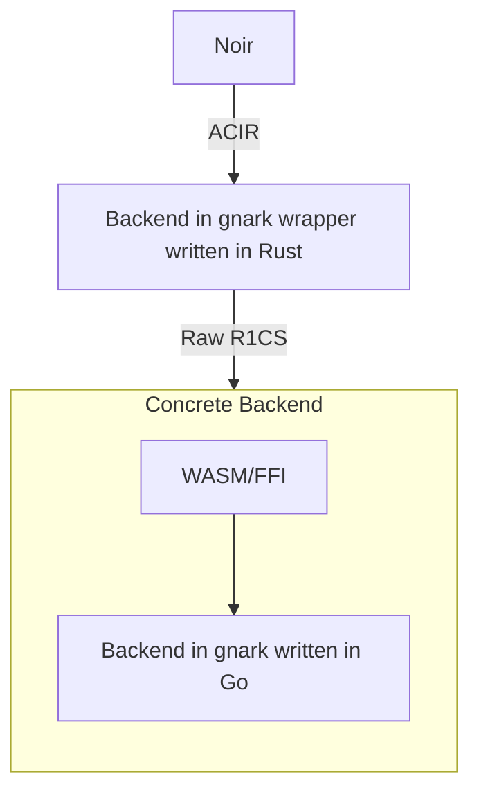

# Using gnark as a backend for Noir

If you want to develop a backend for Noir, basically what you need to do is to translate an ACIR (Abstract Circuit Intermediate Representation) to something that your backend could understand.
The prerequisites for this are to have certain knowledge about ACIR and its codebase, and the backend that you are going to support.
In this case, the backend is [gnark](https://github.com/ConsenSys/gnark). Written in Go, gnark is a fast zk-SNARK library that offers a high-level API to design circuits. This library is open-source and developed under the Apache 2.0 license.

## Overview



### Backend wrapper written in Rust

This module is needed because Noir's backend has to be written in Rust and we want to develop one using gnark which is written in Go.

This Rust module is basically in charge of implementing the trait `Backend` for a given type which we've named `Gnark` which represents our backend and of mapping ACIR into an R1CS-friendly data structure. Even though gnark supports several proving systems (like Plonk and Groth16) this wrapper will translate ACIR into R1CS. In the future, more proving systems can be easily supported (we are already planning on supporting Plonk. By this I mean that, a C++ Plonk implementation is already supported as a backend for Noir, but gnark's Plonk implementation isn't).

The first part is not so difficult. We just followed the other Noir backends' structure (see [Arkwork's Marlin's](https://github.com/noir-lang/marlin_arkworks_backend/tree/master/src) and [Aztec's Plonk's](https://github.com/noir-lang/aztec_backend/tree/master/barretenberg_static_lib/src)).

The second part takes most of the work. It can be cut into two parts: the raw R1CS generation (ACIR translation) and the communication with the concrete backend (glue between Rust and Go). In the following paragraphs, we are going to explain these sub-parts a little bit better.

Generating a raw R1CS or translating ACIR to something R1CS-friendly could be seen as just mapping a struct to another struct. For this, we've made two structs: `RawR1CS` and `RawGate`.

The communication between the concrete backend (the one written in Go) could be done through a pre-compiled WASM API or through FFI. For this, what we are basically doing is serializing the `RawR1CS` struct into JSON and sending it as a parameter for the WASM functions (in the case that we end up using the WASM API) or to the Go functions (FFI). At the moment we are looking for the easiest way to communicate Rust with Go. We started using WASMER but it is a little bit limited in terms of the amount of information that can be sent to a WASM function so we have discarded it for the moment (a second look could help here). Another step can be to try another WASM library called WASM-PACK, but we decided to start researching FFI.

And that's it for this module, in the next section we are going to dive a little deeper into the WASM API.

### ACIR to raw R1CS

The mapping from ACIR to R1CS. I prefer to use "raw" because it is not a concrete R1CS but its component parts.

These are the structures:

#### `RawR1CS`

```rust
pub struct RawR1CS {
    pub gates: Vec<RawGate>,
    pub public_inputs: acvm::PublicInputs,
    pub values: Vec<Fr>,
    pub num_variables: usize,
}
```

#### `RawGate`

```rust
pub struct RawGate {
    pub mul_terms: Vec<(Fr, acvm::Witness, acvm::Witness)>,
    pub add_terms: Vec<(Fr, acvm::Witness)>,
    pub constant_term: Fr,
}
```

### Backends interface (glue)

This module wraps the Go functions in charge of the communication between Rust and Go.

The raw structures are JSON-deserialized and sent to the Go functions.

## Backend written in Go (concrete backend)

This module is the real deal. It is in charge of generating the proof for a given circuit and also of verifying a given proof. Using the raw R1CS received from the backend wrapper, it rebuilds the circuit and generates the proof or verifies a proof (depending on what function you are using).

The API would compile to WASM which is going to be used by the Rust wrapper. Or it would just expose functions for the Rust FFI (again, we are researching which is the easiest way to interface).
